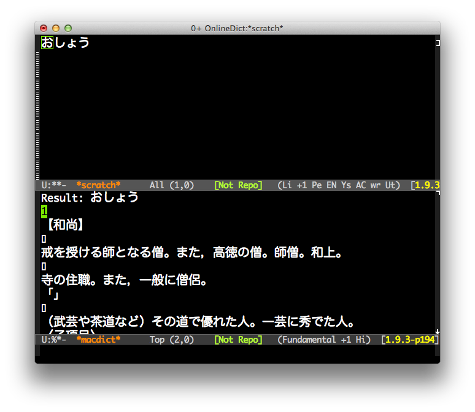

# macdict.el

## Introduction
`macdict.el` is port of [macdict.vim](https://github.com/modsound/macdict-vim).
You can use Dictionary.app from Emacs and you can see its result within Emacs.


## Screenshot

Screenshot of `macdict-japanese`




## Setup

```
 % curl -O https://raw.github.com/modsound/macdict-vim/master/autoload/dict.m
 % clang -Wall -framework Cocoa,Corefoundation -o dict dict.m
 % mv dict.m ~/bin # ~/bin should be passed $PATH
```


## Basic Usage

#### `macdict`

Search word by `macdict-default-lang`

#### `macdict-japanese`

Search from Japanese dictionary

#### `macdict-english`

Search from English dictionary

#### `macdict-thesaurus`

Search from Thesaurus dictionary

#### `macdict-german`

Search from German dictionary

#### `macdict-french`

Search from French dictionary


## Customization

#### `macdict-default-lang`(Default is `'japanse-english`)

Default dictionary language. You can choose it from `'japanese`, `'englush`,
`'japanese-english`, `'thesaurus`, `'french`, `'german`, `'apple`, `'wikipedia`.

#### `macdict-program`(Default is `dict`)

Dictionary command name. You should put it to `$PATH` directory.
